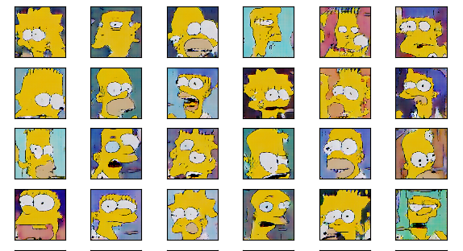

# Simpsons GAN
**NOT FINISH YET**
 
 
This repo is the implementation of BigGAN and the training target is [Simpsons faces](https://www.kaggle.com/kostastokis/simpsons-faces) in kaggle public dataset. Although the implementation refered to BigGAN, but there are still some modifications in order to have a better fit on Simpsons dataset. And this is still an on going project, since the training process of GAN is a brittle work. But the current results seems already done with 50% of work, which means you can tell the generated images are a little bit Simpsons-ly. I will keep updaing the result/code until the generated images are good to go.  

## Model

What original BigGAN do :
 
1. SA-GAN architecture
2. Hinge loss
3. Conditional batch normalization
4. Spectral normalization
5. Moving averages of generator's weights
6. Orthogonal initialization
7. Orthogonal regularization
8. Truncation trick

What I do:
 
1. SA-GAN architecture
2. Hingeloss
3. Spectral normalization
4. Orthogonal regularization
 
I think the conditional batch normalization could improve the results a lot, but unfortunately, the original dataset doesn't have categorical/class label.  

## Training recipe

Most of the hyper-parameters can refer to `project_config.py`, which is pretty much the current model setting. The total training epochs is around 1000 epochs, and the steps of each epoch is `total_epochs//batch_size`. Since the hardware limitation, so the biggest batch size I could use is `64`, and the image/generated image resolution is `(64,64,3)`. Both generator and discriminator are using Adam optimizer with learning rate `1e-4 for G and 2e-4 for D`, and `beta_1 = 0, beta_2 = 0.9`  

## Results

